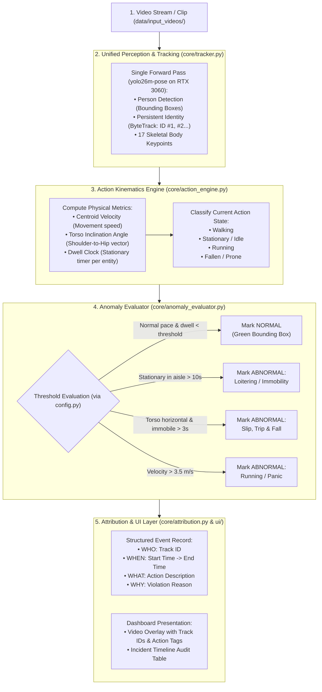

# Autonomous Vision & Behaviour Understanding (HNX26PSI07)
## Master Execution Plan — Clean Modular Architecture & Implementation Strategy

---

## 1. Project Overview & Operational Scenario

* **Challenge:** HNX26PSI07 — Autonomous Vision & Behaviour Understanding
* **Selected Scenario:** **Smart Workplace & Warehouse Safety Monitoring**
  * *Why this wins:* It provides clear, objective boundaries between **Normal** activity (walking along defined walkways, routine brief stops) and **Abnormal** activity (prolonged loitering/immobility in transit aisles, sudden slip/fall accidents, running/panic).
* **Hardware Target:** NVIDIA RTX 3060 (6 GB VRAM) — Capable of running unified detection, tracking, and pose extraction at 55–80+ FPS on CUDA with zero memory bottlenecks.

---

## 2. End-to-End System Architecture

The pipeline processes video through a single perception forward pass, feeding kinematics into a decoupled rule engine and attribution logger.



---

## 3. Clean Folder Architecture & Modular Separation

To ensure production-grade code quality and readability, the codebase strictly separates **configuration**, **computer vision mechanics**, **anomaly rules**, and **UI representation**.

```text
HACKNEX/
│
├── config.py                 # Central configuration: thresholds, model paths, zones (NO hardcoded magic numbers)
├── main.py                   # Clean CLI / pipeline runner (< 80 lines)
│
├── core/                     # Core Vision & Behaviour Engine
│   ├── __init__.py
│   ├── pipeline.py           # Master Pipeline Orchestrator (ties frame -> track -> action -> alert)
│   ├── tracker.py            # YOLO26m-pose + ByteTrack persistent ID wrapper
│   ├── action_engine.py      # Skeletal kinematics & motion physics (Walking, Idle, Running, Fallen)
│   ├── anomaly_evaluator.py  # Rule engine checking behavior states against config thresholds
│   └── attribution.py        # Strict 'Who & When' event schema & JSON audit logger
│
├── ui/                       # Decoupled UI & Presentation Layer
│   ├── app.py                # Dashboard server (Streamlit or FastAPI)
│   ├── static/               # Assets
│   │   ├── css/
│   │   │   └── styles.css    # Clean, modern custom stylesheet
│   │   └── js/
│   │       └── dashboard.js  # Real-time incident list & player sync
│   └── templates/
│       └── index.html        # Semantic HTML layout
│
├── data/                     # Local Test Data & Artifacts
│   ├── input_videos/         # Benchmark clips (Normal, Loitering, Fall)
│   └── output_logs/          # Generated JSON event logs & annotated video files
│
└── EXECUTION_PLAN.md         # Master Architecture & Hackathon Documentation
```

### Module Responsibilities:
1. **`config.py`:** Stores all tunable parameters in one place (e.g. `LOITERING_THRESHOLD_SECONDS = 10.0`, `FALL_CONFIRMATION_SECONDS = 3.0`, `RUNNING_SPEED_THRESHOLD = 3.5`, `DEVICE = "cuda:0"`). Judges can inspect and adjust settings without touching logic.
2. **`core/tracker.py`:** Dedicated strictly to video frame ingestion, running `yolo26m-pose`, and returning persistent `track_id` objects with keypoints.
3. **`core/action_engine.py`:** Pure kinematics. Computes velocities and torso angles. Answers **"What is the entity doing right now?"** without making policy judgments.
4. **`core/anomaly_evaluator.py`:** Evaluates action history against rules. Answers **"Is this behavior normal or unusual?"**
5. **`core/attribution.py`:** Handles immutable event schema creation. Guarantees every alert contains **Who**, **When**, **Where**, and **Why**.
6. **`ui/`:** Independent frontend reading logs and stream. Completely isolated so UI overhead never bottlenecks inference.

---

## 4. Behavior Taxonomy (Normal vs. Abnormal Matrix)

Satisfies the hackathon rule: *"Can't just list detections. Must explain what they're doing, not just that they exist."*

| Behavior State | Action Dynamics & Kinematics | Status | Hackathon Requirement Addressed |
| :--- | :--- | :--- | :--- |
| **Walking** | Upright torso angle + steady centroid velocity ($0.8 - 2.0\text{ m/s}$). | **NORMAL** | Action explanation of routine movement. |
| **Stationary / Pause** | Upright posture + velocity near zero ($v \approx 0$) for $< 10\text{s}$. | **NORMAL** | Routine operational pauses. |
| **Loitering / Immobility** | Upright posture + velocity near zero ($v \approx 0$) maintained for $> 10\text{s}$. | **ABNORMAL** | Problem statement's explicit primary example. |
| **Slip & Fall / Man Down** | Torso angle shifts horizontal ($< 25^\circ$) + prone on floor for $> 3\text{s}$. | **ABNORMAL** | Critical workplace accident detection. |
| **Running / Panic** | Velocity spikes $> 3.5\text{ m/s}$ or sudden acceleration spike across 30 frames. | **ABNORMAL** | Panic or rapid movement in restricted aisles. |

---

## 5. Strict "Who & When" Attribution Schema

Satisfies the hackathon rule: *"Every flag for unusual behavior must point to which entity and when. 'Something weird happened' doesn't count — say who and when."*

Every detected anomaly generates an immutable structured record:

```json
{
  "event_id": "EVT_001",
  "who": {
    "entity_id": "Person #03",
    "class": "Person"
  },
  "when": {
    "start_time": "00:00:14.20",
    "end_time": "00:00:27.50",
    "duration_seconds": 13.3,
    "start_frame": 426,
    "end_frame": 825
  },
  "where": {
    "latest_bbox": [420, 180, 510, 430],
    "centroid": [465, 305]
  },
  "action_summary": "Loitering / Prolonged Immobility",
  "status": "ABNORMAL",
  "evidence": "Entity stationary in transit corridor for > 10.0 seconds."
}
```

---

## 6. How the System Guarantees All 6 Judging Criteria

| Hackathon Judging Criterion | Risk / Failure Mode of Competing Teams | How Our System Guarantees Full Marks |
| :--- | :--- | :--- |
| **1. "Can it recognize what people/objects are doing?"** | Simply displaying generic labels like `"Person (0.85)"` without explaining active behavior. | `core/action_engine.py` uses 17 skeletal keypoints (torso spine angle) and velocity to output explicit active descriptions: *Walking*, *Stationary*, *Running*, *Fallen/Collapsed*. |
| **2. "Does it spot meaningful events?"** | Raising false alarms on every brief stop or minor camera jitter. | Temporal sliding window (30 frames) filters out noise; only surfaces critical operational events (injuries/falls, prolonged loitering in aisles, panic sprints). |
| **3. "Can it tell normal from abnormal behavior?"** | Using black-box models that cannot explain why a flag was raised. | Clean, explainable thresholds in `config.py` evaluate duration and kinematics (e.g. dwell $> 10\text{s}$, fallen duration $> 3\text{s}$, speed $> 3.5\text{ m/s}$). |
| **4. "Does it track the same object across the video?"** | ID switching/jitter when people cross paths or walk behind obstacles. | **ByteTrack** with Kalman filtering predicts trajectory during occlusions, preserving persistent IDs (`Person #1` stays `Person #1`). |
| **5. "Does it find objects accurately?"** | Low detection recall or ghost bounding boxes on background clutter. | Pre-trained `yolo26m-pose` on RTX 3060 provides high-precision human detection with a calibrated confidence threshold ($\ge 0.50$). |
| **6. "Are events detected at the right time?"** | Flagging events long after they occur or failing to specify start/end boundaries. | Frame-accurate timestamps ($t = \text{Frame} / \text{FPS}$) pin down the exact start ($t_{\text{start}}$), end ($t_{\text{end}}$), and duration of every event. |

---

## 7. Phased Implementation Roadmap

### Step 1: Environment & Directory Initialization
* Initialize the clean folder hierarchy (`core/`, `ui/`, `data/`).
* Populate `config.py` with base thresholds and GPU device options.
* Place benchmark test video clips in `data/input_videos/`.

### Step 2: Unified Tracking Pipeline (`core/tracker.py`)
* Load `yolo26m-pose` on RTX 3060 CUDA device.
* Wrap ByteTrack execution (`model.track(source, persist=True)`).
* Verify zero-jitter persistent tracking IDs across frame transitions.

### Step 3: Kinematics & Anomaly Evaluator (`core/action_engine.py` & `core/anomaly_evaluator.py`)
* Implement temporal sliding window (30 frames) per track ID.
* Compute centroid speed, torso inclination, and dwell clocks.
* Evaluate Normal vs Abnormal states based on `config.py` thresholds.

### Step 4: Attribution Logger (`core/attribution.py`)
* Serialize all flagged incidents into the strict JSON audit format.
* Ensure timestamps reflect exact video start and resolution points.

### Step 5: Presentation Dashboard (`ui/`)
* Build a clean video player overlay:
  * Green bounding boxes for Normal behavior.
  * Red bounding boxes with warning badges for Abnormal behavior.
* Live incident table with jump links and exportable audit report.
