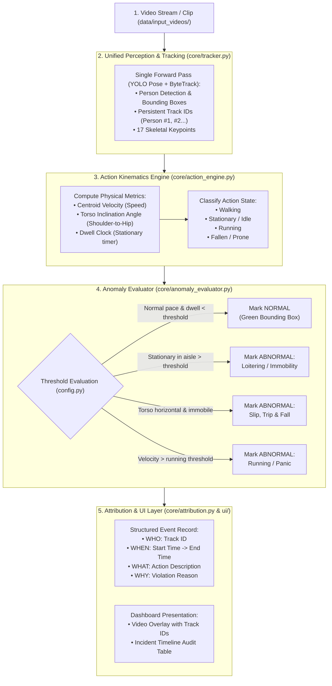

# Autonomous Vision & Behaviour Understanding (HNX26PSI07)

[](https://www.python.org/)
[](https://pytorch.org/)
[](https://github.com/ultralytics/ultralytics)
[](https://fastapi.tiangolo.com/)

A modular computer vision and behavioural understanding system developed for **Smart Workplace & Warehouse Safety Monitoring**. 

The system goes beyond naive object detection: it performs persistent entity tracking, extracts 17 skeletal keypoint kinematics, classifies active physical dynamics, and audits anomalies with frame-accurate **Who**, **When**, **Where**, and **Why** attribution.

---

## 🌟 Key Highlights

- **Unified Perception & Tracking**: Single forward pass for human detection, 17-point skeletal pose estimation, and ByteTrack persistent identity association.
- **Action Kinematics Engine**: Temporal sliding-window smoothing for velocity, torso inclination angle, and dwell clocks (differentiating normal walking/pauses from dangerous immobility).
- **Rule-Based Anomaly Evaluator**: Transparent, explainable behavior thresholds configured in `config.py` (no black boxes).
- **Strict Event Attribution**: Structured JSON audit trail linking every violation to persistent entity ID, frame range, duration, and rationale.
- **Interactive Web Dashboard**: FastAPI and responsive dashboard with live video rendering, real-time metrics, incident timeline, and log export.

---

## 🏗️ System Architecture



---

## 📊 Behavior Taxonomy

| Behavior State | Action Dynamics & Kinematics | Status | Requirement Addressed |
| :--- | :--- | :--- | :--- |
| **Walking** | Upright torso angle + steady centroid velocity. | **NORMAL** | Routine movement along walkways. |
| **Stationary / Pause** | Upright posture + low velocity for $< 5.0\text{s}$. | **NORMAL** | Operational brief pauses. |
| **Loitering / Immobility** | Upright posture + stationary in aisle for $> 5.0\text{s}$. | **ABNORMAL** | Blockage / prolonged idle state. |
| **Slip & Fall / Man Down** | Torso angle shifts horizontal ($\le 35^\circ$) + prone for $> 2.0\text{s}$. | **ABNORMAL** | Immediate workplace accident detection. |
| **Running / Panic** | Velocity spikes above threshold for $> 1.0\text{s}$. | **ABNORMAL** | Emergency, panic, or hazard retreat. |

---

## 📂 Project Structure

```text
HACKNEX/
├── config.py                 # Central configuration: thresholds, model paths, GPU settings
├── main.py                   # Clean CLI pipeline runner
├── requirements.txt          # Python dependencies
├── EXECUTION_PLAN.md         # Detailed architecture & hackathon execution specifications
├── README.md                 # Project documentation
│
├── core/                     # Core Vision & Behaviour Engine
│   ├── __init__.py
│   ├── pipeline.py           # Orchestrator (ties frame -> track -> action -> alert)
│   ├── tracker.py            # YOLO Pose + ByteTrack persistent ID wrapper
│   ├── action_engine.py      # Skeletal kinematics & motion physics
│   ├── anomaly_evaluator.py  # Rule engine checking behavior states against thresholds
│   └── attribution.py        # Strict 'Who & When' schema & JSON audit logger
│
├── models/                   # Pretrained Model Weights
│   ├── yolo26m-pose.pt       # Unified human detection + 17 skeletal keypoints
│   └── yolo26m.pt            # Standard object detection backbone
│
├── ui/                       # Decoupled Web Dashboard
│   ├── app.py                # FastAPI backend & streaming server
│   ├── static/
│   │   ├── css/styles.css    # Clean modern stylesheet
│   │   └── js/dashboard.js   # Real-time incident list & sync
│   └── templates/
│       └── index.html        # Semantic dashboard template
│
├── scripts/                  # Utilities & Benchmark Generators
│   └── generate_benchmark_video.py
│
└── data/                     # Data Storage
    ├── input_videos/         # Source video clips
    └── output_logs/          # Generated JSON event logs & annotated videos
```

---

## 🚀 Getting Started

### 1. Prerequisites & Environment

Clone the repository and install dependencies:

```bash
git clone https://github.com/PRIYATHARISAN/hacknex.git
cd hacknex

python -m venv venv
# Windows:
venv\Scripts\activate
# Linux/macOS:
source venv/bin/activate

pip install -r requirements.txt
```

### 2. Model Weights

The repository already includes the model weights in the `models/` folder:
- `models/yolo26m-pose.pt`
- `models/yolo26m.pt`

### 3. Run via CLI

To process a video file and generate annotated video + audit logs:

```bash
python main.py --input "data/input_videos/WhatsApp Video 2026-10-07 at 12.06.28 PM.mp4"
```

To run a demo test with synthetic scenario generation:

```bash
python main.py --generate-demo
```

### 4. Launch the Web Dashboard

Start the FastAPI application:

```bash
python -m uvicorn ui.app:app --host 0.0.0.0 --port 8000 --reload
```

Then open your browser at `http://127.0.0.1:8000` to interact with the dashboard:
- View live video stream and annotations
- Inspect the real-time incident audit log
- Track active alerts and review historic events

---

## 📋 Audit Event Output Schema

Every detected violation produces an immutable JSON audit record:

```json
{
  "event_id": "EVT_001",
  "who": {
    "entity_id": "Person #03",
    "class": "Person"
  },
  "when": {
    "start_time": "00:00:14.20",
    "end_time": "00:00:27.50",
    "duration_seconds": 13.3,
    "start_frame": 426,
    "end_frame": 825
  },
  "where": {
    "latest_bbox": [420, 180, 510, 430],
    "centroid": [465, 305]
  },
  "action_summary": "Loitering / Prolonged Immobility",
  "status": "ABNORMAL",
  "evidence": "Entity stationary in transit corridor for > 5.0 seconds."
}
```

---

## ⚙️ Configuration

Tune parameters in [config.py](config.py):
- `CONFIDENCE_THRESHOLD`: Detection confidence filter (default `0.35`)
- `STATIONARY_SPEED_THRESHOLD`: Velocity cutoff for immobility (default `50.0 px/s`)
- `RUNNING_SPEED_THRESHOLD`: Speed cutoff for running (default `150.0 px/s`)
- `FALL_TORSO_ANGLE_MAX`: Max torso inclination angle for fall detection (default `35.0 deg`)
- `LOITERING_DURATION_SECONDS`: Immobility duration before flagging an anomaly (default `5.0s`)
- `FALL_CONFIRMATION_SECONDS`: Prone duration to confirm fall/collapse (default `2.0s`)