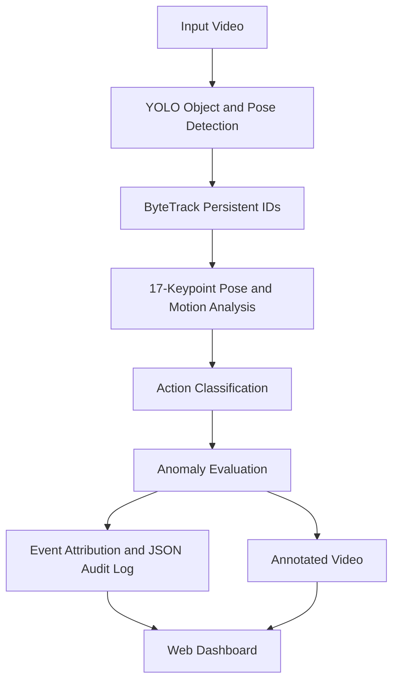

# HNX26PSI07 - Autonomous Vision & Behaviour Understanding


An explainable computer-vision system for smart workplace and warehouse safety monitoring.

The platform goes beyond basic detection. It detects people, tracks persistent identities, estimates body pose, recognizes physical behavior, distinguishes normal from abnormal activity, and records each safety event with precise **who**, **when**, **where**, and **why** context.

## Overview

Finding an object in a video is relatively easy. Understanding what it is doing is more difficult. This project addresses that challenge through a complete video-analysis pipeline that combines:

- Object and person detection.
- Persistent multi-object tracking.
- 17-point human pose estimation.
- Motion and posture analysis.
- Explainable behavior classification.
- Time-based anomaly detection.
- Structured incident attribution.
- Annotated video and web-based review.

The selected use case is workplace and warehouse safety, where normal walking must be distinguished from events such as prolonged inactivity, unexpected running, or a person falling.

## Key Capabilities

### Object Detection

The system detects people in each video frame using YOLO-based detection and returns bounding boxes, confidence scores, and class-filtered results for the selected workplace scenario.

### Persistent Tracking

ByteTrack associates detections across frames and maintains stable identities such as `Person #01` and `Person #02`. This allows an event to be attributed to the same entity throughout the video.

### Behaviour Understanding

The action engine uses temporal motion and pose measurements to classify behavior as:

- Walking.
- Stationary / Idle.
- Running.
- Fallen / Prone.

### Explainable Anomaly Detection

Transparent rules classify behavior as normal or abnormal using configurable thresholds. Alerts are confirmed over time to reduce single-frame noise and false positives.

### Strict Event Attribution

Every confirmed incident contains:

- Persistent entity ID.
- Behavior or anomaly type.
- Start and end timestamps.
- Duration and frame range.
- Bounding-box location and centroid.
- Human-readable explanation.

### Interactive Dashboard

The FastAPI dashboard provides:

- Video upload and preview.
- Original and AI-annotated video comparison.
- Synchronized playback controls.
- Analysis progress monitoring.
- Incident audit timeline.
- Tracked-entity and incident metrics.
- Browser-compatible annotated video playback.

## System Architecture



### Processing Flow

1. A video is uploaded or selected from the input directory.
2. YOLO detects people and estimates their pose.
3. ByteTrack assigns and maintains persistent entity IDs.
4. The action engine calculates speed, torso angle, aspect ratio, and stationary duration.
5. The behavior classifier assigns an action state.
6. The anomaly evaluator applies temporal safety rules.
7. The attribution layer records the event and its evidence.
8. The pipeline renders overlays and publishes the result through the dashboard.

## Behaviour Taxonomy

| Behaviour | Detection Evidence | Status | Safety Interpretation |
|---|---|---|---|
| Walking | Upright posture and movement above the stationary threshold | Normal | Routine movement through the workplace |
| Stationary / Pause | Low movement for a short duration | Normal | Normal pause or temporary stop |
| Loitering / Prolonged Inactivity | Stationary behavior continues beyond the dwell threshold | Abnormal | Possible blockage or unusual inactivity |
| Running / Panic | Sustained velocity above the running threshold | Abnormal | Possible emergency or unsafe movement |
| Slip & Fall / Man Down | Horizontal torso posture or fallback aspect-ratio evidence sustained over time | Abnormal | Possible workplace accident |

The demonstration configuration uses a five-second loitering threshold, a two-second fall confirmation period, and a one-second running confirmation period. These values can be adjusted in `config.py` for a specific operational environment, such as a ten-minute loitering policy.

## Challenge Requirement Mapping

| Requirement | Project Implementation |
|---|---|
| Explain what people are doing | Action states describe walking, idling, running, and falling rather than only listing detections. |
| Detect meaningful events | The system identifies prolonged inactivity, running/panic, and possible falls. |
| Separate normal and abnormal behavior | Configurable temporal rules classify routine activity versus safety anomalies. |
| Track the same entity | ByteTrack maintains persistent IDs across video frames. |
| Detect objects accurately | YOLO provides bounding boxes, confidence scores, and pose keypoints. |
| Identify when events occur | Events use frame numbers, FPS-based timestamps, start time, end time, and duration. |

## Audit Event Example

Every confirmed violation is exported as structured JSON similar to the following:

```json
{
  "event_id": "EVT_001",
  "who": {
    "entity_id": "Person #03",
    "class": "Person"
  },
  "when": {
    "start_time": "00:00:14.20",
    "end_time": "00:00:27.50",
    "duration_seconds": 13.3,
    "start_frame": 426,
    "end_frame": 825
  },
  "where": {
    "latest_bbox": [420, 180, 510, 430],
    "centroid": [465, 305]
  },
  "action_summary": "Loitering / Prolonged Immobility",
  "status": "ABNORMAL",
  "evidence": "Entity stationary in transit corridor for > 5.0 seconds."
}
```

## Project Structure

```text
HACKNEX/
├── config.py                 # Thresholds, model paths, and hardware settings
├── main.py                   # Command-line pipeline runner
├── requirements.txt          # Python dependencies
├── EXECUTION_PLAN.md         # Architecture and execution specifications
├── HNX26PSI07_REPORT.md      # Challenge-alignment project report
│
├── core/                     # Vision and behavior engine
│   ├── pipeline.py           # End-to-end processing and video rendering
│   ├── tracker.py            # YOLO detection, pose estimation, and ByteTrack
│   ├── action_engine.py      # Motion, posture, and action classification
│   ├── anomaly_evaluator.py  # Rule-based anomaly evaluation
│   └── attribution.py        # Who/When event logging
│
├── models/                   # Model weights
│   ├── yolo26m-pose.pt       # Human detection and 17-keypoint pose model
│   └── yolo26m.pt            # Standard object-detection model
│
├── ui/                       # FastAPI dashboard
│   ├── app.py                # API, analysis execution, and video streaming
│   ├── static/                # CSS and dashboard JavaScript
│   └── templates/             # HTML templates
│
├── scripts/                  # Utilities and benchmark generators
└── data/
    ├── input_videos/         # Source video clips
    └── output_logs/          # Annotated videos and JSON event logs
```

## Getting Started

### Prerequisites

- Python 3.10 or newer.
- A working PyTorch installation.
- FFmpeg available on the system PATH for browser-compatible annotated video conversion.
- NVIDIA CUDA is recommended but CPU execution is supported.

### Installation

```bash
git clone https://github.com/PRIYATHARISAN/hacknex.git
cd hacknex

python -m venv venv
```

Activate the virtual environment:

```bash
# Windows
venv\Scripts\activate

# Linux/macOS
source venv/bin/activate
```

Install dependencies:

```bash
pip install -r requirements.txt
```

### Run the Command-Line Pipeline

Process a video and generate an annotated output video and audit log:

```bash
python main.py --input "data/input_videos/your_video.mp4"
```

Generate and process the synthetic benchmark video:

```bash
python main.py --generate-demo
```

### Launch the Web Dashboard

```bash
python -m uvicorn ui.app:app --host 0.0.0.0 --port 8000 --reload
```

Open the dashboard at [http://127.0.0.1:8000](http://127.0.0.1:8000).

## Configuration

Behavior and detection thresholds are centralized in `config.py`:

| Setting | Purpose | Default |
|---|---|---:|
| `CONFIDENCE_THRESHOLD` | Minimum detection confidence | `0.35` |
| `IOU_THRESHOLD` | Intersection-over-Union threshold | `0.45` |
| `STATIONARY_SPEED_THRESHOLD` | Maximum speed considered stationary | `50.0 px/s` |
| `RUNNING_SPEED_THRESHOLD` | Minimum speed considered running | `150.0 px/s` |
| `FALL_TORSO_ANGLE_MAX` | Maximum torso angle for fall detection | `35.0 deg` |
| `LOITERING_DURATION_SECONDS` | Duration before inactivity becomes abnormal | `5.0 s` |
| `FALL_CONFIRMATION_SECONDS` | Duration required to confirm a fall | `2.0 s` |
| `RUNNING_CONFIRMATION_SECONDS` | Duration required to confirm running/panic | `1.0 s` |

## Hardware Acceleration

The system automatically selects CUDA when a compatible NVIDIA GPU is available and falls back to CPU otherwise. The dashboard reports the active acceleration mode during use.

## Scope and Limitations

The current implementation is optimized for people and behavior analysis in workplace and warehouse videos. It supports multiple predefined behavior classes through explainable rules, but it is not yet a fully general anomaly-discovery system for every possible object or unknown behavior.

Performance may vary with camera angle, lighting, occlusion, video resolution, and crowd density. These factors are natural areas for future evaluation and improvement.

## Future Enhancements

- Restricted-zone and emergency-exit rules.
- Personal protective equipment detection.
- Abandoned-object and unauthorized-entry detection.
- Automatic scene-specific threshold calibration.
- Multi-camera identity association.
- Learned detection of previously unseen anomalies.
- SMS, email, and control-room notifications.
- Labelled-video evaluation with precision, recall, and event-timing metrics.

## License and Project Context

This project was developed for the HNX26PSI07 challenge: **Autonomous Vision & Behaviour Understanding**.
